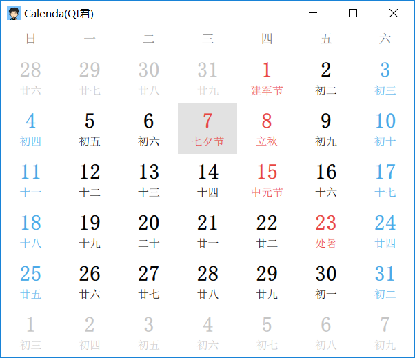
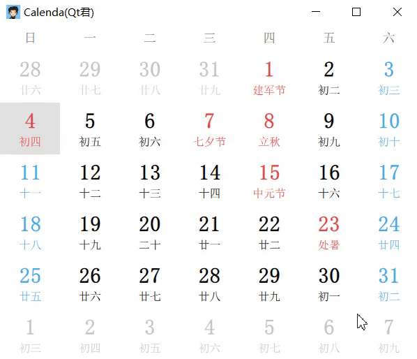
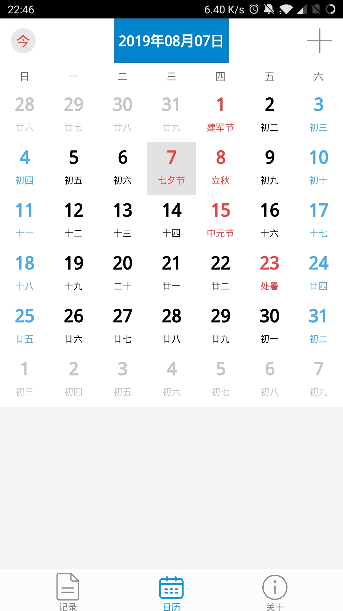

<!-- ---
title: 兼容Qt4/Qt5版本Qml控件Calendar
date: 2019-08-04 22:12:33
tags: Qml
comments: true
--- -->

> 通过点击日历控件区域，选择日期的Qml组件。

|Calendar|备注|
|---|---|
|导入方法|文件导入|
|兼容性|`QtQuick 1.x`与`QtQuick 2.x`|
|继承|GridView|


<!--more-->
## 属性
**信号**：  
* `signal clicked(variant date)` : 在日历中的有效日期上**单击**鼠标时发出，`date`是鼠标被单击的**日期**。

**方法**：  
* `function today()` ：**重定位**到**当天**日期
* `function getDate()` : **获取**日历当前日期
* `function setDate(date)` : **设置**日历的日期


## 示例
```javascript
Calendar {
    width: 600; height: 480
}
```


## 部分源码预览

```js
    /**
     * @brief 在日历中的有效日期上单击鼠标时发出。
     * @param date: 鼠标被单击的日期。
     */
    signal clicked(variant date)

    /**
     * @brief 重定位到当天日期
     */
    function today() {
        var today = new Date()
        setDate(today)
    }

    /**
     * @brief 获取日历当前日期
     */
    function getDate() {
        return privateVar.getYMD(root.currentIndex)
    }

    /**
     * @brief 设置日历的日期
     */
    function setDate(date) {
        privateVar.monthAndYearNumber = [date.getMonth() + 1, date.getFullYear()]
        root.currentIndex = privateVar.getIndexByDate(date.getDate(), date.getMonth()+1, date.getFullYear())

        /* 更新日期任务列表 */
        __setNoteDates(privateVar.noteDates)
    }

    Item {
        id: weekItem
        width: root.width; height: root.height/13
        Repeater {
            model: ["日", "一", "二", "三", "四", "五", "六"]
            Item {
                x: index * width
                width: root.cellWidth; height: weekItem.height

                Text {
                    anchors.centerIn: parent
                    text: model.modelData
                    font.pixelSize: dpW(14)
                    color: "#666666"
                }
            }
        }
    }
```

## 关于
* 文章首发于公众号**Qt君**
* [源码地址](https://github.com/QtComponent/Calendar):
```
https://github.com/QtComponent/Calendar
```
* [最新源码下载地址](https://github.com/QtComponent/Calendar/archive/master.zip)
```
https://github.com/QtComponent/Calendar/archive/master.zip
```
* 相关应用：
[安卓日历](https://github.com/aeagean/Calendar)
```
https://github.com/aeagean/Calendar
```

